# MASC Stock — Guide utilisateur

> Public : les personnes qui gèrent le stock de consommables au quotidien
> (réceptions, livraisons aux clients, inventaires, fiches client).

---

## 1. À quoi sert MASC Stock

MASC Stock suit les consommables d'imprimerie de MA SOFT CONSULTING
(toners, tambours, développeurs, bacs de récupération) :

- ce qui **entre** en stock (livraisons des fournisseurs) ;
- ce qui **sort** du stock (livraisons aux clients) ;
- ce qu'il **reste** en stock, et ce qu'il faut **recommander** ;
- ce qui a été **livré à chaque client**, avec une fiche imprimable.

**À retenir :** on ne saisit jamais directement une quantité en stock. Le stock
se calcule tout seul à partir des entrées et des sorties. Pour corriger un
stock, on fait un **inventaire** ; pour corriger une erreur, on **annule** le
mouvement.

---

## 2. Se connecter

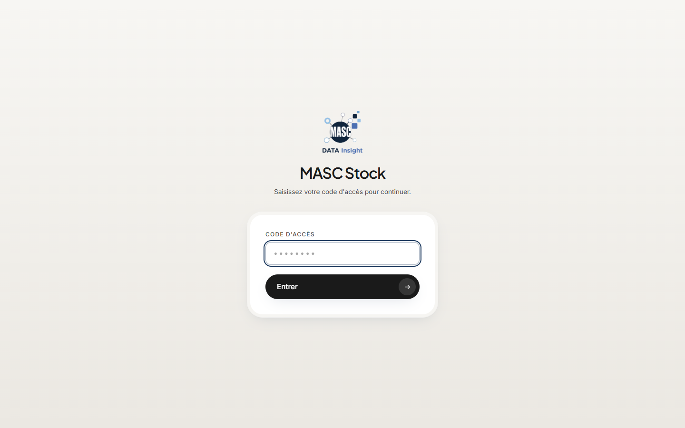

1. Ouvrez l'adresse de MASC Stock dans votre navigateur.
2. Saisissez le **code d'accès** et cliquez sur **Entrer**.

La connexion reste active 30 jours sur cet appareil. Pour vous déconnecter,
cliquez sur **Quitter** en haut à droite (sur téléphone : menu ☰ puis
**Se déconnecter**).

---

## 3. Le tableau de bord

C'est la page d'accueil. Elle répond en un coup d'œil à la question « que
dois-je faire aujourd'hui ? ».

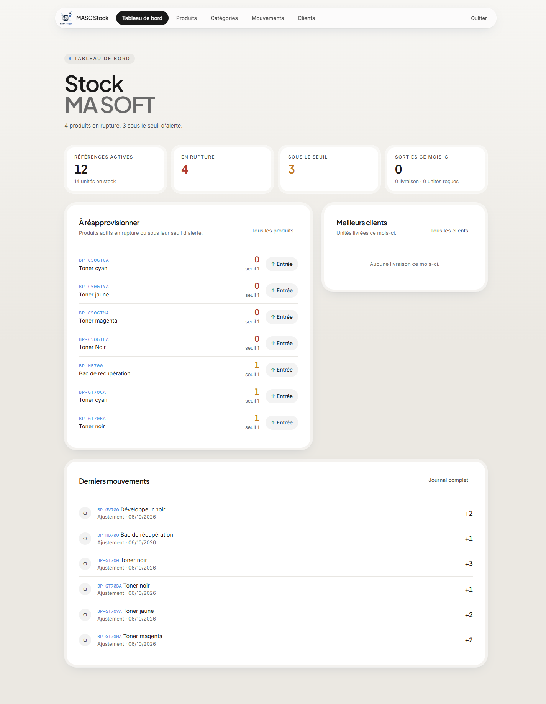

| Zone | Ce qu'elle indique |
|---|---|
| **Références actives** | Nombre de produits suivis et total d'unités en stock |
| **En rupture** (rouge) | Produits à 0 |
| **Sous le seuil** (orange) | Produits arrivés à leur seuil d'alerte : à recommander |
| **Sorties ce mois-ci** | Unités livrées aux clients depuis le 1er du mois |
| **À réapprovisionner** | La liste des produits à recommander, les ruptures en premier. Le bouton **↑ Entrée** ouvre directement la réception de ce produit |
| **Meilleurs clients** | Les clients les plus livrés ce mois-ci |
| **Derniers mouvements** | Les 6 dernières opérations |

---

## 4. Les produits

Menu **Produits**. Chaque produit a une référence (ex. `BP-GT70CA`), un nom,
une catégorie, des imprimantes compatibles et un **seuil d'alerte** : quand le
stock descend à ce seuil, le produit passe en « À commander ».

### 4.1 Consulter et rechercher

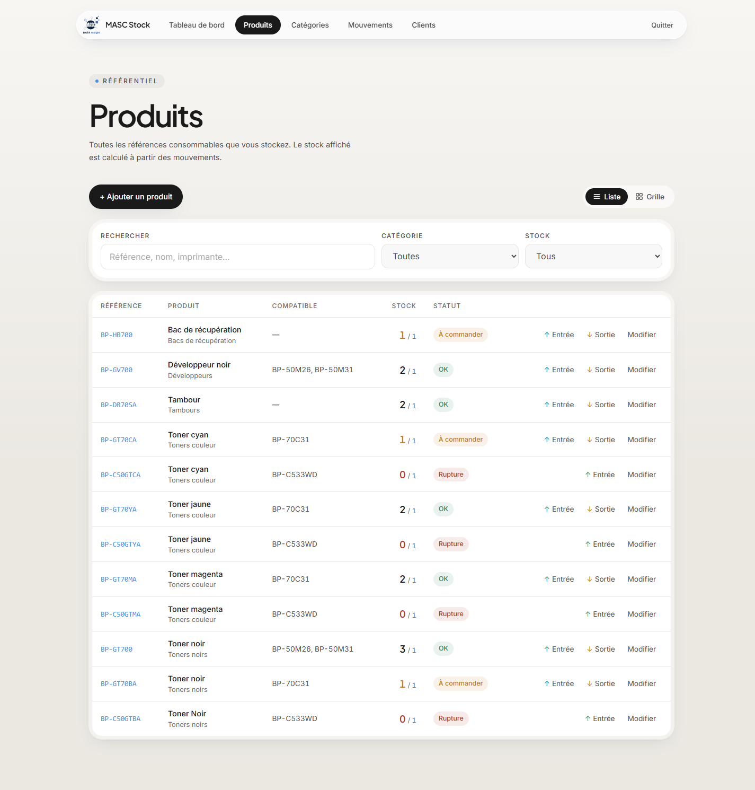

- **Rechercher** : tapez une référence, un nom ou un modèle d'imprimante. La
  recherche ignore les tirets, les espaces et les accents : `bpgt70ca` trouve
  `BP-GT70CA`.
- **Filtrer** par catégorie, ou par stock (« À réapprovisionner », « En
  rupture »).
- **Stock** : `1 / 1` signifie « 1 en stock, seuil 1 ». Couleur et pastille
  indiquent l'état : **OK**, **À commander**, **Rupture**.
- Sur chaque ligne : **↑ Entrée** et **↓ Sortie** ouvrent la saisie avec le
  produit déjà choisi.

### 4.2 Liste ou grille

Le bouton **Liste / Grille** en haut à droite change l'affichage. La liste est
la plus compacte ; la grille présente un produit par carte. Le choix est
mémorisé pour chaque page.

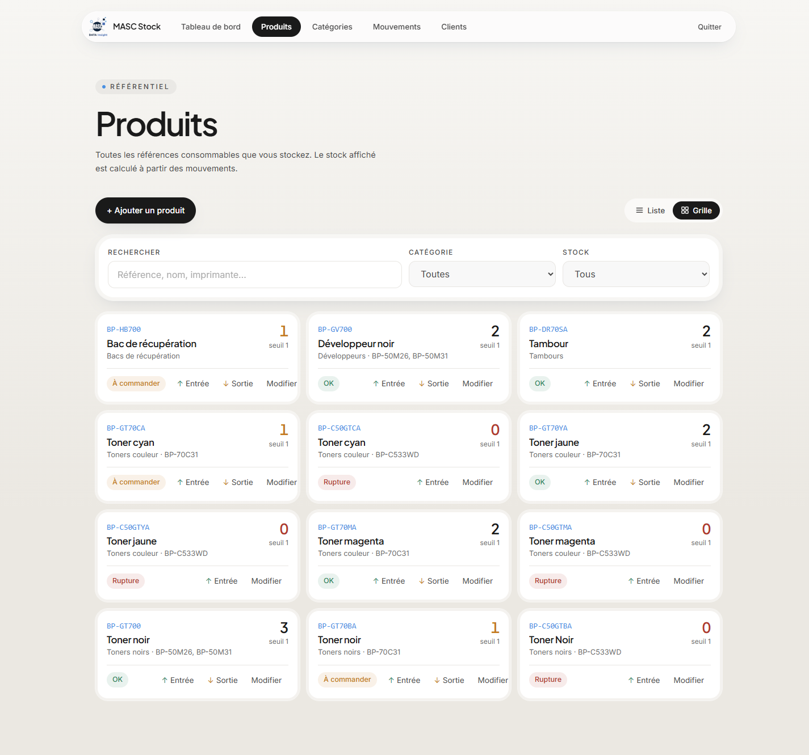

### 4.3 Ajouter un produit

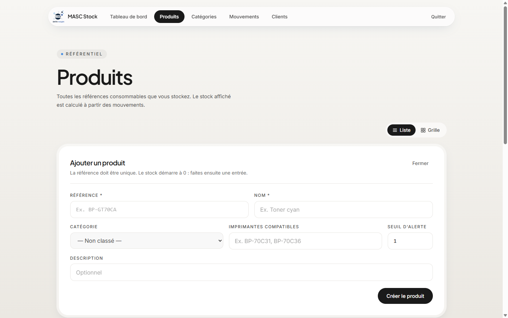

1. Cliquez sur **+ Ajouter un produit**.
2. Renseignez la **référence** (unique) et le **nom** — obligatoires.
3. Choisissez la **catégorie**, indiquez les **imprimantes compatibles**
   (ex. `BP-70C31, BP-70C36`) et le **seuil d'alerte**.
4. Cliquez sur **Créer le produit**.

Le stock d'un nouveau produit est à **0** : enregistrez ensuite une **entrée**
(§6.1).

### 4.4 Modifier, désactiver, supprimer

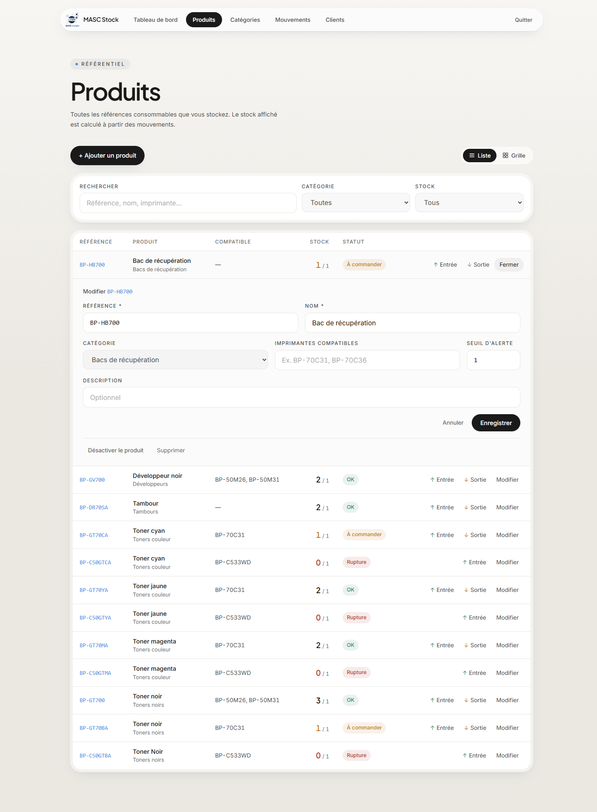

1. Cliquez sur **Modifier** sur la ligne du produit.
2. Corrigez les champs puis **Enregistrer**.
3. En bas du panneau :
   - **Désactiver le produit** : il disparaît des listes de saisie mais reste
     dans l'historique. À utiliser pour un produit qu'on ne vend plus.
   - **Supprimer** : possible uniquement si le produit n'a **aucun**
     mouvement. Sinon, désactivez-le.

---

## 5. Les catégories

Menu **Catégories**. Elles regroupent les produits (Toners noirs, Toners
couleur, Tambours…).

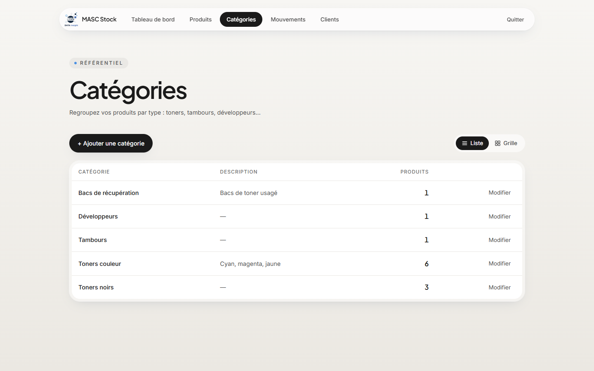

- **+ Ajouter une catégorie** : nom et description.
- **Modifier** : renommer, désactiver ou supprimer. Une catégorie qui contient
  des produits ne peut pas être supprimée.

---

## 6. Les mouvements

Menu **Mouvements**. C'est le journal de toutes les opérations, la plus récente
en tête.

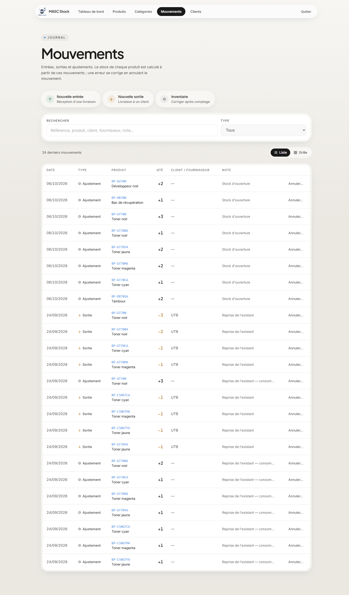

| Type | Signe | Quand |
|---|---|---|
| **Entrée** ↑ | `+` vert | Réception d'une livraison fournisseur |
| **Sortie** ↓ | `−` orange | Livraison d'un consommable à un client |
| **Ajustement** ⚙ | `+` ou `−` | Correction après inventaire, stock d'ouverture |
| **Annulation** ↺ | inverse | Correction d'une erreur de saisie |

La recherche porte sur la référence, le produit, le client, le fournisseur et
la note.

### 6.1 Enregistrer une entrée (réception)

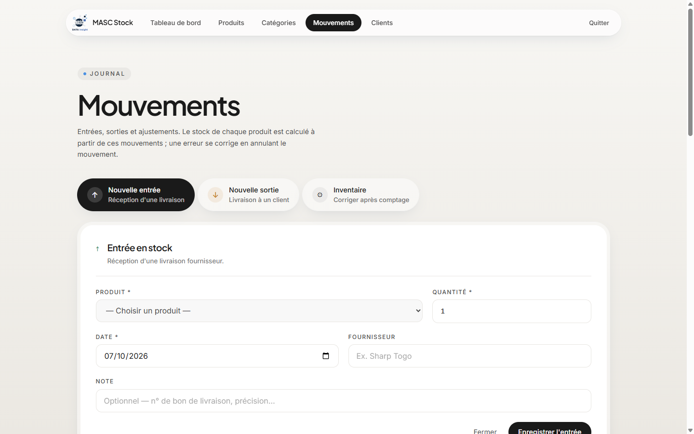

1. Cliquez sur **Nouvelle entrée**.
2. Choisissez le **produit** : la liste indique le stock actuel de chacun.
3. Saisissez la **quantité** reçue et la **date**.
4. Indiquez le **fournisseur** et, si utile, une **note** (n° de bon de
   livraison).
5. Cliquez sur **Enregistrer l'entrée**. Un message de confirmation s'affiche
   en bas de l'écran.

### 6.2 Enregistrer une sortie (livraison à un client)

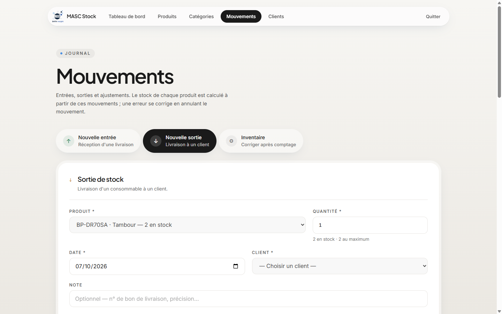

1. Cliquez sur **Nouvelle sortie**.
2. Choisissez le **produit**. Les produits à 0 sont grisés : impossible de
   sortir ce qu'on n'a pas.
3. Saisissez la **quantité** : le maximum disponible est affiché sous le
   champ.
4. Choisissez le **client** (obligatoire) et la **date**.
5. Cliquez sur **Enregistrer la sortie**.

La livraison apparaît aussitôt sur la fiche du client (§8).

### 6.3 Corriger une erreur : annuler un mouvement

Un mouvement enregistré ne se modifie pas et ne se supprime pas : l'historique
doit rester fiable. Pour corriger une erreur (mauvaise quantité, mauvais
client, mauvais produit) :

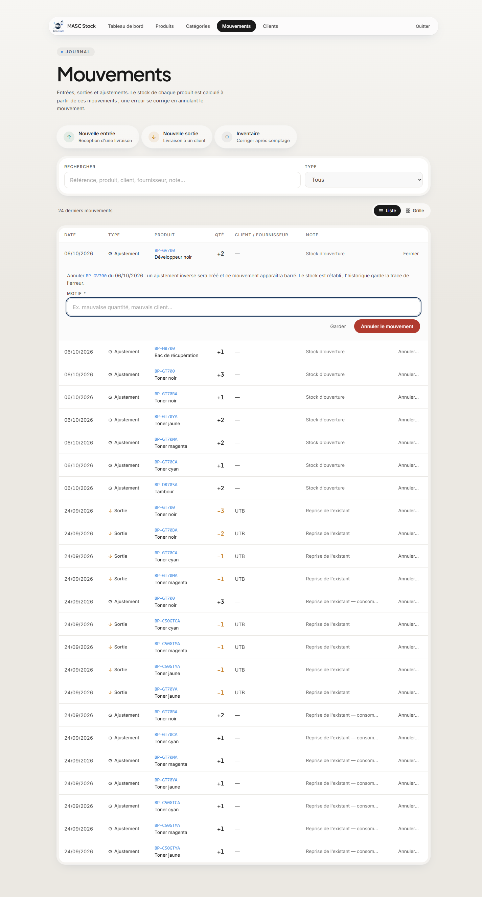

1. Sur la ligne du mouvement erroné, cliquez sur **Annuler…**.
2. Indiquez le **motif** (ex. « mauvaise quantité »).
3. Cliquez sur **Annuler le mouvement**.
4. **Ressaisissez** ensuite le bon mouvement.

Le mouvement annulé reste visible, **barré** avec la mention « Annulé », et le
stock est rétabli. Il n'est plus compté sur les fiches client.

---

## 7. L'inventaire physique

Menu **Mouvements → Inventaire**. À faire après un comptage réel du stock (fin
de mois, fin d'année, doute sur un produit).

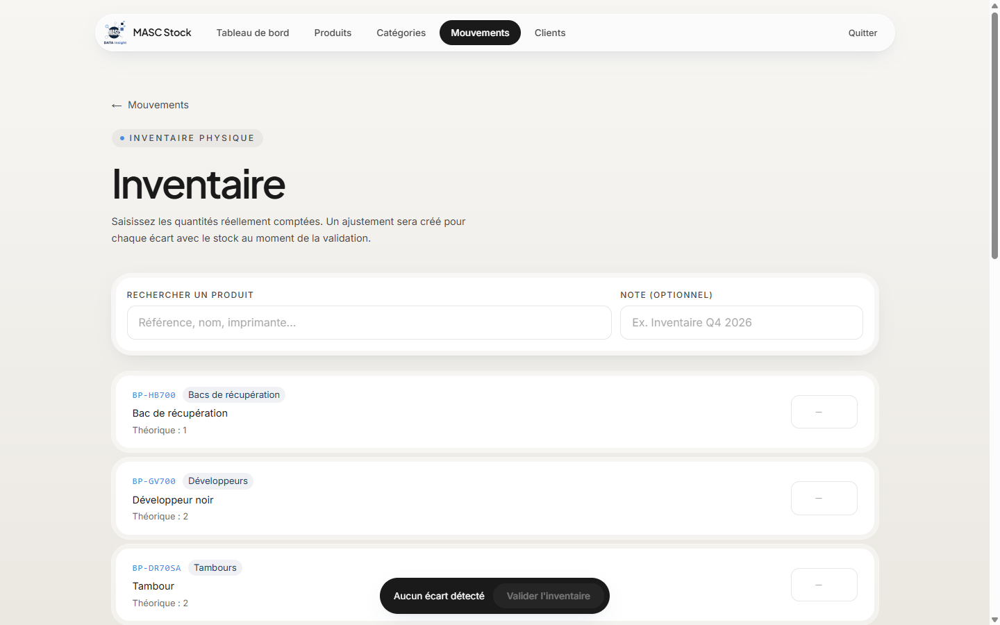

1. Pour chaque produit compté, saisissez la **quantité réellement présente**.
   « Théorique » indique ce que l'application attend.
2. L'écart s'affiche à côté (`+2` en vert, `−1` en rouge, `=` si identique).
3. Laissez vide un produit non compté : il ne sera pas touché.
4. Ajoutez une **note** si besoin (ex. « Inventaire octobre 2026 »).
5. Cliquez sur **Valider l'inventaire** (barre en bas de l'écran).

Un ajustement est créé pour chaque écart. Les quantités saisies restent
mémorisées même si vous utilisez la recherche entre-temps.

---

## 8. Les clients et leur fiche d'inventaire

Menu **Clients**. Les clients sont créés dans **MASC Fiche** : ils apparaissent
automatiquement ici.

### 8.1 Liste des clients

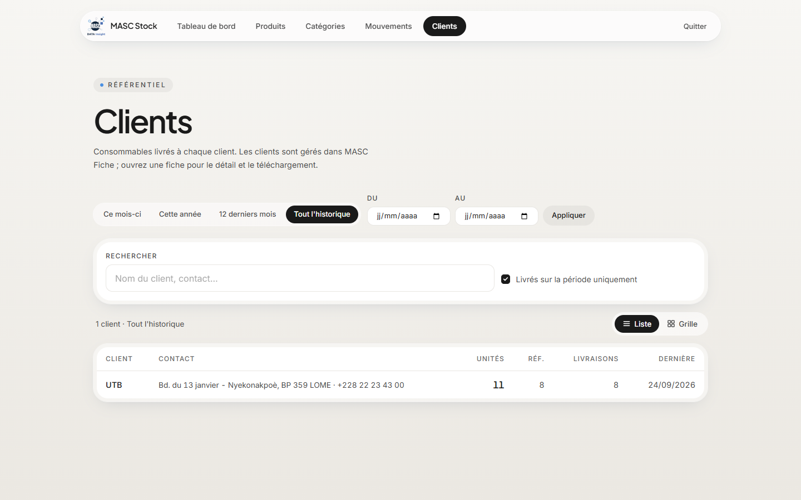

1. Choisissez la **période** : ce mois-ci, cette année, 12 derniers mois, tout
   l'historique, ou des dates précises (**Du / Au** puis **Appliquer**).
2. Décochez « Livrés sur la période uniquement » pour voir aussi les clients
   sans livraison.
3. Cliquez sur le nom d'un client pour ouvrir sa fiche.

### 8.2 Fiche d'inventaire client

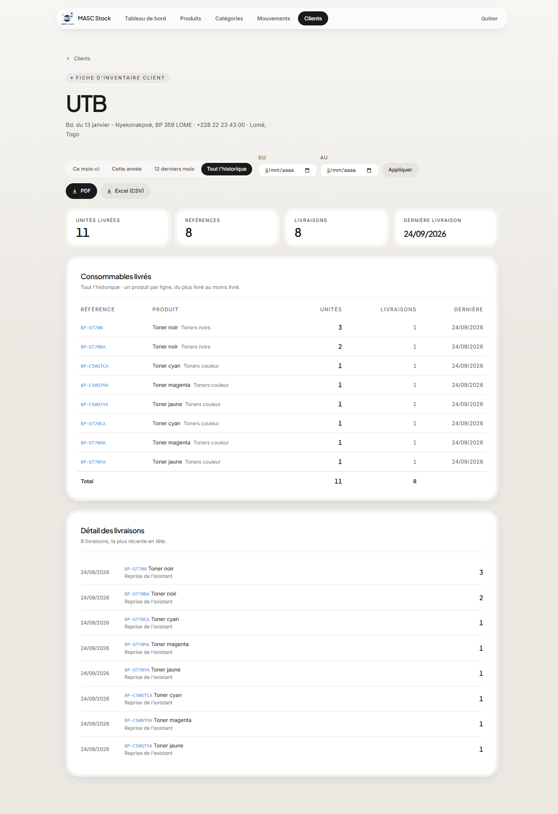

La fiche montre, pour la période choisie :

- les totaux : unités livrées, références, livraisons, dernière livraison ;
- **Consommables livrés** : un produit par ligne, du plus livré au moins livré ;
- **Détail des livraisons** : chaque livraison avec sa date et sa note.

**Télécharger :**

- **PDF** : fiche mise en page avec le logo, prête à imprimer ou à faire
  **signer par le client** (cadres de signature prévus). Le détail des
  livraisons est en annexe.
- **Excel (CSV)** : le même contenu en tableau, à ouvrir dans Excel.

---

## 9. Sur téléphone

L'application s'utilise aussi sur téléphone. Le menu est accessible par le
bouton ☰ en haut à droite.

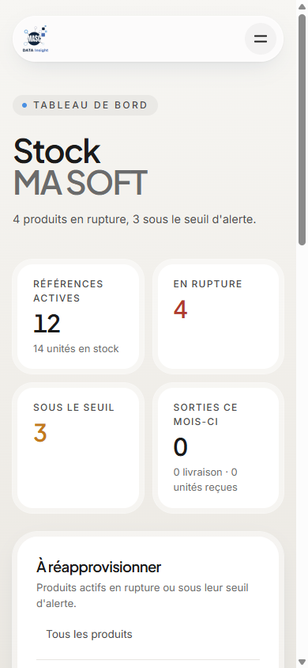

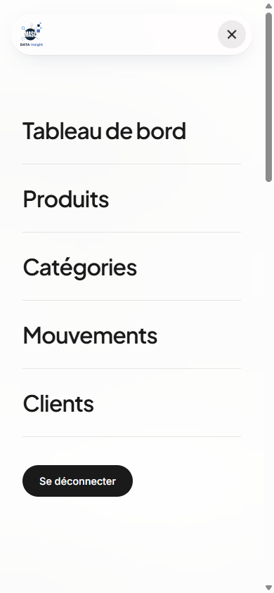

Sur petit écran, les colonnes secondaires des tableaux sont masquées ; passez
en vue **Grille** pour un affichage plus confortable.

---

## 10. Questions fréquentes

| Question | Réponse |
|---|---|
| Je me suis trompé de quantité ou de client | **Mouvements → Annuler…** sur la ligne, avec un motif, puis ressaisissez le bon mouvement (§6.3) |
| Le produit est grisé dans la liste des sorties | Son stock est à 0 : enregistrez d'abord l'entrée |
| Message « Stock insuffisant » | Vous essayez de sortir plus que le stock disponible |
| Le stock affiché ne correspond pas à ce que je vois en rayon | Faites un **inventaire** (§7) |
| Je ne trouve pas un client | Il doit être créé dans **MASC Fiche** |
| Je ne peux pas supprimer un produit | Il a déjà des mouvements : **désactivez-le** (§4.4) |
| Page « Données indisponibles » | Problème de connexion à la base : cliquez sur **Réessayer**. Si cela persiste, prévenez l'administrateur |
| On me redemande le code d'accès | La session a expiré (30 jours) ou le code a été changé : reconnectez-vous |
